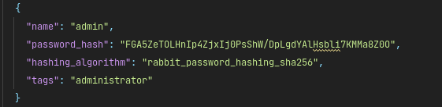
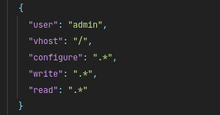

## Setup RabbitMQ
### Setup RabbitMQ with docker

* Generate rabbitmq password hash for your user by using `rmq_password_hash.py` file.
* To generate the hash use this command
```
python3 rmq_password_hash.py
```

#### It will ask your password like the below


* Once you generate the password hash do update the generated hash for your respective user.
    * `configurations/rabbitmq.conf`
        * change `default_pass` value with your generated password hash. And if you  want to change the username too please change the `default_user` value with your username.
    * `configurations/definitions.json`
        * change the values
    
    
          
* Note: change the `name` value if you changed the username.

Once you done with the above steps it's time to run the RabbitMQ.

`docker-compose up -d`

To check the logs do run this command:

`docker-compose logs -f`

